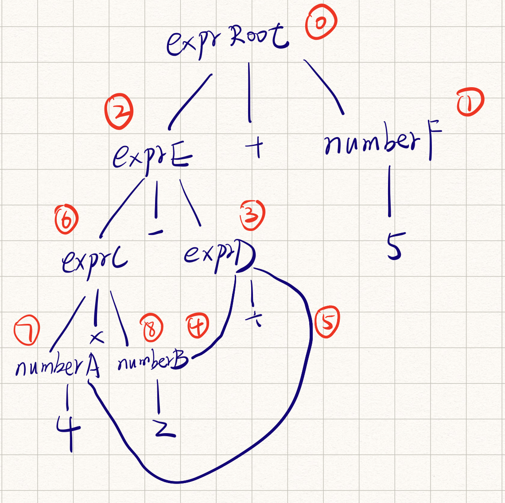

# lab3 实验报告
PB18061351 闫超美

## 问题1: cpp与.ll的对应
请描述你的cpp代码片段和.ll的每个BasicBlock的对应关系。描述中请附上两者代码。

#### assign

**.cpp文件**

```c++
#include "BasicBlock.h"
#include "Constant.h"
#include "Function.h"
#include "IRBuilder.h"
#include "Module.h"
#include "Type.h"

#include <iostream>
#include <memory>

#define CONST_INT(num) \
    ConstantInt::get(num, module)

#define CONST_FP(num) \
    ConstantFP::get(num, module) // 得到常数值的表示,方便后面多次用到

int main(){

    auto module = new Module("assign");
    auto builder = new IRBuilder(nullptr, module);
    Type *Int32Type = Type::get_int32_type(module);

    // main函数
    auto mainFun = Function::create(FunctionType::get(Int32Type, {}),
                                  "main", module);
    auto bb = BasicBlock::create(module, "entry", mainFun);
    builder->set_insert_point(bb);

    auto *arraytype = ArrayType::get(Int32Type, 10);
    auto aAlloca = builder->create_alloca(arraytype);

    auto a0GEP = builder->create_gep(aAlloca, {CONST_INT(0), CONST_INT(0)});
    builder->create_store(CONST_INT(10),a0GEP);
    auto a0load = builder->create_load(a0GEP);

    auto a1GEP = builder->create_gep(aAlloca, {CONST_INT(0), CONST_INT(1)});
    auto mul = builder->create_imul(a0load, CONST_INT(2));
    builder->create_store(mul, a1GEP);
    builder->create_ret(mul);
    // 输出中间代码
    std::cout << module->print();
    delete module;
    return 0;
}
```

**生成的.ll文件**

```shell
define i32 @main() {
entry:
  %0 = alloca [10 x i32]
  %1 = getelementptr [10 x i32], [10 x i32]* %0, i32 0, i32 0
  store i32 10, i32* %1
  %2 = load i32, i32* %1
  %3 = getelementptr [10 x i32], [10 x i32]* %0, i32 0, i32 1
  %4 = mul i32 %2, 2
  store i32 %4, i32* %3
  ret i32 %4
}
```

cpp文件中的语句与生成的.ll中的Basic block中的语句是有对应关系的，如下：

```cpp
auto *arraytype = ArrayType::get(Int32Type, 10);
auto aAlloca = builder->create_alloca(arraytype);
与
%0 = alloca [10 x i32]
/**********************************************************************************************/
auto a0GEP = builder->create_gep(aAlloca, {CONST_INT(0), CONST_INT(0)});
与
%1 = getelementptr [10 x i32], [10 x i32]* %0, i32 0, i32 0
/**********************************************************************************************/
builder->create_store(CONST_INT(10),a0GEP);
与
store i32 10, i32* %1
/**********************************************************************************************/
auto a0load = builder->create_load(a0GEP);
与
%2 = load i32, i32* %1    
/**********************************************************************************************/
auto a1GEP = builder->create_gep(aAlloca, {CONST_INT(0), CONST_INT(1)});
与
%3 = getelementptr [10 x i32], [10 x i32]* %0, i32 0, i32 1
/**********************************************************************************************/
auto mul = builder->create_imul(a0load, CONST_INT(2));
与
%4 = mul i32 %2, 2
/**********************************************************************************************/
builder->create_store(mul, a1GEP);
与
store i32 %4, i32* %3
/**********************************************************************************************/
builder->create_ret(mul);
与
ret i32 %4
/**********************************************************************************************/
```


#### fun

这部分的.ll文件中有两个函数，也就是两个Basicblock。其中callee函数的entry block:

```cpp
    auto calleeFun = Function::create(calleeFunTy, "callee",module);
    auto bb = BasicBlock::create(module, "entry", calleeFun);

    builder->set_insert_point(bb);  // 一个BB的开始,将当前插入指令点的位置设在bb
	std::vector<Value *> args;  // 获取calleeFun函数的形参,通过Function中的iterator
    for (auto arg = calleeFun->arg_begin(); arg != calleeFun->arg_end(); arg++) {
        args.push_back(*arg);   // * 号运算符是从迭代器中取出迭代器当前指向的元素
    }    

    auto callee_mul = builder->create_imul(args[0], CONST_INT(2)); // 做乘法
    builder->create_ret(callee_mul); // return 乘法结果

与
    
define i32 @callee(i32 %0) {
entry:
  %1 = mul i32 %0, 2
  ret i32 %1
}
    
```

main函数的entry block：

```cpp
    bb = BasicBlock::create(module, "entry", mainFun);
    builder->set_insert_point(bb);
	auto call = builder->create_call(calleeFun, {CONST_INT(110)}); // call callee函数
    builder->create_ret(call); // return call

与
    
define i32 @main() {
entry:
  %0 = call i32 @callee(i32 110)
  ret i32 %0
}
```


#### if

entry block的对应关系

```cpp
    // main函数
    auto mainFun = Function::create(FunctionType::get(Int32Type, {}),
                                  "main", module);
    auto bb = BasicBlock::create(module, "entry", mainFun);
    builder->set_insert_point(bb);

    Type* Floatty = Type::get_float_type(module);
    auto a = builder->create_alloca(Floatty);
    builder->create_store(CONST_FP(5.555), a);
    auto a_value = builder->create_load(a);
    auto fcmp = builder->create_fcmp_gt(a_value, CONST_FP(1.0));

    auto TrueBB = BasicBlock::create(module, "TrueBB", mainFun);
    auto FalseBB = BasicBlock::create(module, "FalseBB", mainFun);
    builder->create_cond_br(fcmp, TrueBB, FalseBB);

与
    
entry:
  %0 = alloca float
  store float 0x40163851e0000000, float* %0
  %1 = load float, float* %0
  %2 = fcmp ugt float %1,0x3ff0000000000000
  br i1 %2, label %TrueBB, label %FalseBB
```

TrueBB的对应关系

```cpp
    // block TrueBB
    builder->set_insert_point(TrueBB);
    builder->create_ret(CONST_INT(233));

与
    
TrueBB:
  ret i32 233
```

FalseBB的对应关系

```cpp

    // block FalseBB
    builder->set_insert_point(FalseBB);
    builder->create_ret(CONST_INT(0));

与
    
FalseBB:
  ret i32 0
```


#### while

entry block

```cpp
    auto bb = BasicBlock::create(module, "entry", mainFun);
    builder->set_insert_point(bb);

    auto a = builder->create_alloca(Int32Type);
    auto i = builder->create_alloca(Int32Type);

    builder->create_store(CONST_INT(10), a);
    builder->create_store(CONST_INT(0), i);

与
    
entry:
  %0 = alloca i32
  %1 = alloca i32
  store i32 10, i32* %0
  store i32 0, i32* %1
  br label %label1
```

label1 block

```cpp
    builder->create_br(label1);

    // block label1
    builder->set_insert_point(label1);
    auto a_value = builder->create_load(a);
    auto i_value = builder->create_load(i);
    auto icmp = builder->create_icmp_lt(i_value, CONST_INT(10));
    builder->create_cond_br(icmp, while_body, end);

与

label1:
  %2 = load i32, i32* %0
  %3 = load i32, i32* %1
  %4 = icmp slt i32 %3, 10
  br i1 %4, label %while_body, label %end
     
```

while_body block

```cpp
    // block while_body
    builder->set_insert_point(while_body);
    auto i_new = builder->create_iadd(i_value, CONST_INT(1));
    auto a_new = builder->create_iadd(a_value, i_new);
    builder->create_store(i_new, i);
    builder->create_store(a_new, a);
    builder->create_br(label1);

与
    
while_body:
  %5 = add i32 %3, 1
  %6 = add i32 %2, %5
  store i32 %5, i32* %1
  store i32 %6, i32* %0
  br label %label1
```

end block

```cpp
    // block end
    builder->set_insert_point(end);
    builder->create_ret(a_value);
与
    
end:
  ret i32 %2
```


## 问题2: Visitor Pattern
请指出visitor.cpp中，`treeVisitor.visit(exprRoot)`执行时，以下几个Node的遍历序列:numberA、numberB、exprC、exprD、exprE、numberF、exprRoot。  

遍历序列：

exprRoot->numberF->exprE->exprD->numberB->numberA->exprC->numberA->numberB

我的理解：

`visitor.cpp`这个文件中main函数中定义的Node构成的树如下：



我们主要通过`TreeVisitor`这个类提供的visit函数来对Node进行遍历，对于不同类型的Node，执行不同的操作：

* 对于`AddSubNode`类型的Node，先执行这个节点**右儿子**的`accept`方法，再执行**左儿子**的`accept`方法，不同类型的节点都对Node父类的accept方法进行了重载，这个方法做的事就是执行`treeVisitor.visit(*this);`对此节点进行访问。要注意对于`AddSubNode`类型节点儿子的访问顺序是**先右后左**，得到两个儿子的值后根据**op**的类型来做运算后返回。
* 对于`MulDivNode`类型的Node，对儿子的访问顺序是**先左后右**，得到两个儿子的值后根据**op**的类型来做运算后返回。
* 对于`NumberNode`类型的Node，直接返回`node.number`。


这样一看在`treeVisitor.visit(exprRoot)`执行时，就会从上图的那颗树的根节点开始访问，然后根据当前访问节点的类型执行不同的`visit()`函数，对于exprRoot节点，是`AddSubNode`类型，先访问右节点，也就是numberF，执行此节点的accept()方法，然后返回`treeVisitor.visit(*this);`，即对`NumberNode`类型执行visit()函数，直接返回这个节点的number，也就是5。然后访问exprRoot的左节点即exprE，exprE节点也是`AddSubNode`类型，所以也是先访问右节点再访问左节点......

按照这样的规则对这棵树进行访问得到的访问顺序就如上图。


## 问题3: getelementptr
请给出`IR.md`中提到的两种getelementptr用法的区别,并稍加解释:
  - `%2 = getelementptr [10 x i32], [10 x i32]* %1, i32 0, i32 %0` 
  - `%2 = getelementptr i32, i32* %1 i32 %0` 

```txt
前者是计算得到包含十个元素的数组中第 %0 个元素的地址，其中，[10 x i32]代表类型，[10 x i32]* %1代表初始地址，i32 0表示结构体数组中结构体内部的偏移量，i32 %0表示从初始地址偏移 %0 个结构体

后者是返回一个地址，i32* %1表示初始地址，i32 %0表示在初始地址基础上偏移%0得到的地址，将此地址返回给%2

```

## 实验难点
描述在实验中遇到的问题、分析和解决方案

### 1. .ll 文件编写

.ll文件是LLVM IR代码，也就是由C编译得到的中间代码，有一点类似汇编，是一种三地址码。

### assign_hand.ll

```shell
define dso_local i32 @main() #0 {
    ; 声明一个10个元素的数组，得到指针放在%1里
    %1 = alloca [10 x i32], align 4
    ; 获得a[0]的地址放在%2
    %2 = getelementptr inbounds [10 x i32], [10 x i32]* %1, i64 0, i64 0
    ; 将10存储到%2指向的内存单元，也就是a[0]所在的位置
    store i32 10, i32* %2, align 4
    ; 将a[0]的值取出来放到%3
    %3 = load i32, i32* %2, align 4
    ; 获得a[1]的地址放在%4
    %4 = getelementptr inbounds [10 x i32], [10 x i32]* %1, i64 0, i64 1
    ; 将%3与2相乘存到%5,也就是a[0] * 2
    %5 = mul i32 %3,2
    ; 将%5的值也就是乘法结果放在%4指向的位置，也就是a[1]
    store i32 %5, i32* %4, align 4
    ; 结果返回a[1]，也就是%5的值
    ret i32 %5
}
```

在实验中遇到了第一个问题就是寄存器的编号问题，左值的编号需要按照顺序来，不然用 lli 执行的时候会报错并提示你 xxx 期望的序号是 xxx

assign.ll这里遇到的问题有：

1. 一开始使用getelementptr命令时遇到了报错，原因是我误以为这个函数得到的是一个值，其实它得到的是指向这个数组元素的一个指针，然后想要修改数组元素的值要用store指令。还有就是用getelemetptr指令时传入offset的类型是i32时会报错，改成i64就好了，不知道为什么。
2. 还遇到一个疑问就是啥时候需要alloca，我用clang生成的似乎alloca了很多东西，但是我自己写的却只是对数组进行了alloca，普通的变量就没管那么多了。后来想了一下觉得应该是数组需要存在内存里，所以需要alloca，而普通的变量只需要存在临时的寄存器就ok了，其实就把它当汇编写就ok


#### while_hand.ll

```shell
define dso_local i32 @main() #0 {
    ; 声明两个int变量 %1指向a %2指向i
    %1 = alloca i32
    %2 = alloca i32
    ; 将10存入a 将0存入i
    store i32 10, i32* %1
    store i32 0, i32* %2
    ; 跳转到3
    br label %3
3:
    ; load一下 %4的值为a的值 %5的值为i的值
    %4 = load i32, i32* %1
    %5 = load i32, i32* %2
    ; 比较i与10，若i<10 %6为1跳转到7，否则跳转到10
    %6 = icmp slt i32 %5, 10
    br i1 %6, label %7, label %10
     
7:
    ; 循环体部分，%5+1 也就是i+1存入%8
    %8 = add i32 %5, 1
    ; %4+%8也就是a+i存入%9
    %9 = add i32 %4, %8
    ; 将之前计算的值%8存入i %9存入a
    store i32 %8, i32* %2
    store i32 %9, i32* %1
    ; 跳转到标签3
    br label %3
10:
    ; 如果跳出循环体 就返回a的值
    ret i32 %4
}
```

这里遇到的坑比较多，最大的一个坑就是左值寄存器需要按照顺序编号，而且标签用数字的时候标签也要和寄存器一起编号。

然后就是没意识到标签前面是要接br命令的，导致一开始报错了。


### 2. LightIR + cpp 编写生成.ll的程序

这里主要的思路就是对着自己写的ll文件调用lightIR的API一条一条翻译过去，这样就能生成可以work的ll代码，这部分按照助教提供的gcd.cpp来对照着写，一路非常顺利，感谢助教。


## 实验反馈
建议减少report的分数

感谢用心的助教